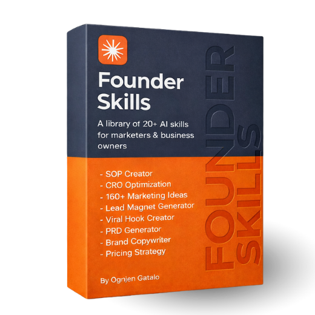

# Claude Code skills pack for founders, marketers, content creators and business owners.

This repository contains 20+ Claude skills that will help you turn Claude into a Fortune 500 growth team.

Stop prompting from scratch and use 20+ proven marketing, copywriting, and product skills companies pay millions for.


## Installation

### Via Terminal (npx)

```bash
npx skills add https://github.com/ognjengt/founder-skills
```

Install a specific skill:

```bash
npx skills add https://github.com/ognjengt/founder-skills --skill prd-generator
```

### Via Plugin System (Claude Code & Cowork)

```
/plugin marketplace add ognjengt/founder-skills
/plugin install founder-skills@founder-skills
```

## Available Skills

| Skill | Description |
|-------|-------------|
| `sop-creator` | Creates detailed Standard Operating Procedures for business processes |
| `cro-optimization` | Analyzes landing pages against 13 CRO principles and provides detailed optimization recommendations with before/after examples |
| `viral-hook-creator` | Creates viral hooks for content and marketing |
| `lead-magnet-generator` | Creates viral lead magnet posts with CTAs that drive comments and DMs — produces quick and detailed formats for Twitter/X and LinkedIn |
| `strategic-planning` | Analyzes your business to deliver 3 specific, high-impact next moves for growth (marketing/sales) — asks diagnostic questions when needed to uncover bottlenecks and opportunities |
| `go-to-market-plan` | Delivers 3 best go-to-market strategies tailored to your product, stage, and market — asks diagnostic questions about product readiness, ICP, competitive positioning, and distribution channels |
| `x-writer` | Creates 3 viral X (Twitter) posts in different proven formats with creator voice matching (Hormozi, Naval, Gazdecki, Dakota, Machina, Ognjen) — uses 51+ post templates and 8 format structures |
| `linkedin-writer` | Creates 2 viral LinkedIn posts in different proven formats with voice matching — uses 8+ post templates and 7 format structures (Lessons Learned, Blueprint, Story, Strategy, Case Study, Hot Take, Quick Hack) |
| `outreach-specialist` | Crafts high-converting outreach sequences (cold email, LinkedIn DM, X DM) using 8 proven templates with follow-up strategy, platform-specific rules, and personalized messaging that books calls |
| `competitor-intel` | Analyzes competitors with verified metrics, leverage strategies, and predicted next moves |
| `brand-copywriter` | Writes marketing copy using proven frameworks (AIDA, PAS, BAB, etc.) for ads, landing pages, emails, and more |
| `pricing-strategist` | Builds comprehensive pricing strategies with tiered plans, price justifications, and revenue optimization through interactive Q&A |
| `prd-generator` | Generates professional PRD documents optimized for AI coding tools — asks clarifying questions and outputs PDF to `./prd_outputs/` |
| `product-hunt-launch-plan` | Creates comprehensive, personalized Product Hunt launch plans to rank #1 — includes hour-by-hour battle plan, templates, and 20+ alternative launch platforms |
| `marketing-ideas` | Produces the 5 best marketing ideas for your business from a curated database of 160+ proven strategies — tailored to your industry, audience, and goals |

## Usage

After installation, use skills in Claude Code by typing:

```
/sop-creator create an employee onboarding process
```

```
/linkedin-writer write a post about our new product launch
```

## Customizing for Your Business

After installation, create the `FOUNDER_CONTEXT.md` in your project root, and copy the contents from this repository.

Then replace the fields with your own custom values so that the skills are tailored to you:

- Company name and industry
- Target audience and value proposition
- Brand voice and tone
- Business goals
- Products/services

Skills automatically check for this file and use it to personalize outputs.
Each project can have its own context file for different businesses or clients.

## Contributing

Want to add a new skill? See [CLAUDE.md](CLAUDE.md) for development guidelines.

### Skill Structure

```
skills/
└── your-skill/
    ├── SKILL.md        # Main skill definition
    └── references/     # Additional reference materials
```

## License

MIT
